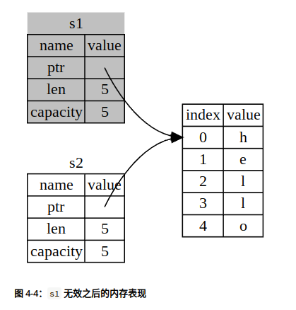
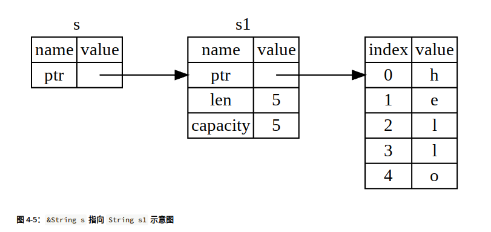
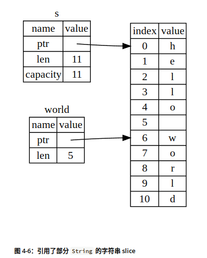

### 3.常见编程概念

#### 3.1 变量与可变性

##### 常量

首先，不允许对常量使用 `mut`。常量不光默认不可变，它总是不可变。声明常量使用 `const` 关键字而不是 `let`，并且 *必须* 注明值的类型。

最后一个区别是，常量只能被设置为常量表达式，而不可以是其他任何只能在运行时计算出的值。Rust 对常量的命名约定是在单词之间使用全大写加下划线。编译器能够在编译时计算一组有限的操作，这使我们可以选择以更容易理解和验证的方式写出此值，而不是将此常量设置为值 10,800。


##### 隐藏

`mut` 与隐藏的一个区别是，当再次使用 `let` 时，实际上创建了一个新变量，我们可以改变值的类型，并且复用这个名字。然而，如果尝试使用 `mut`，我们不能改变变量的类型，将会得到一个编译时错误。


#### 3.2 数据类型

我们将看到两类数据类型子集：标量（scalar）和复合（compound）。

根据值及其使用方式，编译器通常可以推断出我们想要用的类型。当多种类型均有可能时，必须增加类型注解，像这样：

```rust
let guess: u32 = "42".parse().expect("Not a number!");
```

Rust 的 `char` 类型的大小为四个字节 (four bytes)，并代表了一个 Unicode 标量值


##### 元组类型

元组长度固定：一旦声明，其长度不会增大或缩小，元组中每一个位置都有一个类型。

这个例子中使用了可选的类型注解：

```rust
fn main() {
    let tup: (i32, f64, u8) = (500, 6.4, 1);
}
```

`tup` 变量绑定到整个元组上，因为元组是一个单独的复合元素。为了从元组中获取单个值，可以使用模式匹配（pattern matching）来解构（destructure）元组值，像这样：

```rust
fn main() {
    let tup = (500, 6.4, 1);
    let (x, y, z) = tup;
    println!("The value of y is: {y}");
}
```

我们也可以使用点号（`.`）后跟值的索引来直接访问它们。例如：

```rust
fn main() {
    let x: (i32, f64, u8) = (500, 6.4, 1);

    let five_hundred = x.0;
    let six_point_four = x.1;
    let one = x.2;
}
```

不带任何值的元组有个特殊的名称，叫做 **单元（unit）** 元组。这种值以及对应的类型都写作 `()`，表示空值或空的返回类型。如果表达式不返回任何其他值，则会隐式返回单元值。


##### 数组

可以像这样编写数组的类型：

```rust
let a: [i32; 5] = [1, 2, 3, 4, 5];
```

你还可以通过在方括号中指定初始值加分号再加元素个数的方式来创建一个每个元素都为相同值的数组：

```rust
let a = [3; 5];
```


#### 3.3 函数

Rust 不关心函数定义所在的位置，只要函数被调用时出现在调用之处可见的作用域内就行。

在函数签名中，**必须** 声明每个参数的类型。当定义多个参数时，使用逗号分隔，像这样：

```rust
fn main() {
    print_labeled_measurement(5, 'h');
}

fn print_labeled_measurement(value: i32, unit_label: char) {
    println!("The measurement is: {value}{unit_label}");
}
```


##### 语句和表达式

**语句**（*Statements*）是执行一些操作但不返回值的指令。 **表达式**（*Expressions*）计算并产生一个值。

函数体由一系列的语句和一个可选的结尾表达式构成。

函数定义是语句。

函数调用是一个表达式。宏调用是一个表达式。用大括号创建的一个新的块作用域也是一个表达式，例如：

```rust
fn main() {
    let y = {
        let x = 3;
        x + 1
    };

    println!("The value of y is: {y}");
}
```

这个表达式：

```rust
{
    let x = 3;
    x + 1
}
```

是一个代码块，它的值是 `4`。这个值作为 `let` 语句的一部分被绑定到 `y` 上。


##### 具有返回值的函数

在 Rust 中，函数的返回值等同于函数体最后一个表达式的值。使用 `return` 关键字和指定值，可从函数中提前返回；但大部分函数隐式的返回最后的表达式。这是一个有返回值的函数的例子：

```rust
fn five() -> i32 {
    5
}

fn main() {
    let x = five();
    println!("The value of x is: {x}");
}
```


#### 3.4 控制流

##### 在 `let` 语句中使用 `if`

因为 `if` 是一个表达式，我们可以在 `let` 语句的右侧使用它，例如在示例 3-2 中：

```rust
fn main() {
    let condition = true;
    let number = if condition { 5 } else { 6 };

    println!("The value of number is: {number}");
}
```


`if` 的每个分支的可能的返回值都必须是相同类型。如果它们的类型不匹配，如下面这个例子，会出现一个错误：

```rust
fn main() {
    let condition = true;
    let number = if condition { 5 } else { "six" };

    println!("The value of number is: {number}");
}
```

`if` 代码块中的表达式返回一个整数，而 `else` 代码块中的表达式返回一个字符串。这不可行，因为变量必须只有一个类型。Rust 需要在编译时就确切的知道 `number` 变量的类型，这样它就可以在编译时验证在每处使用的 `number` 变量的类型是有效的。


### 4.认识所有权

#### 4.1 什么是所有权

##### 栈与堆

入栈比在堆上分配内存要快，因为（入栈时）分配器无需为存储新数据去搜索内存空间；其位置总是在栈顶。相比之下，在堆上分配内存则需要更多的工作，这是因为分配器必须首先找到一块足够存放数据的内存空间，并接着做一些记录为下一次分配做准备。

访问堆上的数据比访问栈上的数据慢，因为必须通过指针来访问。现代处理器在内存中跳转越少就越快（缓存）。处理器在处理的数据彼此较近的时候（比如在栈上）比较远的时候（比如可能在堆上）能更好的工作。

跟踪哪部分代码正在使用堆上的哪些数据，最大限度的减少堆上的重复数据的数量，以及清理堆上不再使用的数据确保不会耗尽空间，这些问题正是所有权系统要处理的。


##### 所有权规则

> 1. Rust 中的每一个值都有一个 **所有者**（*owner*）。
> 2. 值在任一时刻有且只有一个所有者。
> 3. 当所有者（变量）离开作用域，这个值将被丢弃。


##### `String` 类型

可以使用 `from` 函数基于字符串字面值来创建 `String`，如下：

```rust
let s = String::from("hello");
```

**可以** 修改此类字符串：

```rust
    let mut s = String::from("hello");
    s.push_str(", world!"); // push_str() 在字符串后追加字面值
    println!("{}", s); // 将打印 `hello, world!`
```


##### 内存与分配

Rust 采取了一个不同的策略：内存在拥有它的变量离开作用域后就被自动释放。下面是示例 4-1 中作用域例子的一个使用 `String` 而不是字符串字面值的版本：

```rust
    {
        let s = String::from("hello"); // 从此处起，s 是有效的

        // 使用 s
    }                                  // 此作用域已结束，
                                       // s 不再有效
```

这是一个将 `String` 需要的内存返回给分配器的很自然的位置：当 `s` 离开作用域的时候。当变量离开作用域，Rust 为我们调用一个特殊的函数。这个函数叫做 [`drop`](https://doc.rust-lang.org/std/ops/trait.Drop.html#tymethod.drop)，在这里 `String` 的作者可以放置释放内存的代码。Rust 在结尾的 `}` 处自动调用 `drop`。


##### 变量与数据交互的方式（一）：移动

让我们看看示一个使用整型的例子。

```rust
    let x = 5;
    let y = x;
```

我们大致可以猜到这在干什么：“将 `5` 绑定到 `x`；接着生成一个值 `x` 的拷贝并绑定到 `y`”。现在有了两个变量，`x` 和 `y`，都等于 `5`。

像整型这样的在编译时已知大小的类型被整个存储在栈上，所以拷贝其实际的值是快速的。这意味着没有理由在创建变量 `y` 后使 `x` 无效。

这也正是事实上发生了的，因为整数是有已知固定大小的简单值，所以这两个 `5` 被放入了栈中。

现在看看这个 `String` 版本：

```rust
    let s1 = String::from("hello");
    let s2 = s1;
```

为了确保内存安全，在 `let s2 = s1;` 之后，Rust 认为 `s1` 不再有效，因此 Rust 不需要在 `s1` 离开作用域后清理任何东西。

拷贝指针、长度和容量而不拷贝数据可能听起来像浅拷贝。不过因为 Rust 同时使第一个变量无效了，这个操作被称为 **移动**（*move*），而不是叫做浅拷贝。上面的例子可以解读为 `s1` 被 **移动** 到了 `s2` 中。



##### 变量与数据交互的方式（二）：克隆

如果我们 **确实** 需要深度复制 `String` 中堆上的数据，而不仅仅是栈上的数据，可以使用一个叫做 `clone` 的通用函数。

这是一个实际使用 `clone` 方法的例子：

```rust
    let s1 = String::from("hello");
    let s2 = s1.clone();

    println!("s1 = {}, s2 = {}", s1, s2);
```

这段代码能正常运行，并且明确产生图 4-3 中行为，这里堆上的数据 **确实** 被复制了。


#### 4.2 引用与借用

##### 引用

**引用**（*reference*）像一个指针，因为它是一个地址，我们可以由此访问储存于该地址的属于其他变量的数据。 与指针不同，引用确保指向某个特定类型的有效值。

下面是如何定义并使用一个（新的）`calculate_length` 函数，它以一个对象的引用作为参数而不是获取值的所有权：

```rust
fn main() {
    let s1 = String::from("hello");
    let len = calculate_length(&s1);
    println!("The length of '{}' is {}.", s1, len);
}

fn calculate_length(s: &String) -> usize {
    s.len()
}
```

注意我们传递 `&s1` 给 `calculate_length`，同时在函数定义中，我们获取 `&String` 而不是 `String`。这些 & 符号就是 **引用**，它们允许你使用值但不获取其所有权。



我们将创建一个引用的行为称为 **借用**（*borrowing*）。

正如变量默认是不可变的，引用也一样。（默认）不允许修改引用的值。


##### 可变引用

我们通过一个小调整就能允许我们修改一个借用的值，这就是 **可变引用**（*mutable reference*）：

```rust
fn main() {
    let mut s = String::from("hello");

    change(&mut s);
}

fn change(some_string: &mut String) {
    some_string.push_str(", world");
}
```

首先，我们必须将 `s` 改为 `mut`。然后在调用 `change` 函数的地方创建一个可变引用 `&mut s`，并更新函数签名以接受一个可变引用 `some_string: &mut String`。这就非常清楚地表明，`change` 函数将改变它所借用的值。

可变引用有一个很大的限制：如果你有一个对该变量的可变引用，你就不能再创建对该变量的引用。

这一限制以一种非常小心谨慎的方式允许可变性，防止同一时间对同一数据存在多个可变引用。这个限制的好处是 Rust 可以在编译时就避免数据竞争。**数据竞争**（*data race*）类似于竞态条件，它可由这三个行为造成：

- 两个或更多指针同时访问同一数据。
- 至少有一个指针被用来写入数据。
- 没有同步数据访问的机制。


下面的代码会产生错误：

```rust
    let mut s = String::from("hello");

    let r1 = &s; // 没问题
    let r2 = &s; // 没问题
    let r3 = &mut s; // 大问题

    println!("{}, {}, and {}", r1, r2, r3);
```

哇哦！我们 **也** 不能在拥有不可变引用的同时拥有可变引用。


#### 4.3 Slice 类型

##### 字符串 Slice

**字符串 slice**（*string slice*）是 `String` 中一部分值的引用，它看起来像这样：

```rust
    let s = String::from("hello world");

    let hello = &s[0..5];
    let world = &s[6..11];
```



对于 Rust 的 `..` range 语法，如果想要从索引 0 开始，可以不写两个点号之前的值。换句话说，如下两个语句是相同的：

```rust
let s = String::from("hello");

let slice = &s[0..2];
let slice = &s[..2];
```

依此类推，如果 slice 包含 `String` 的最后一个字节，也可以舍弃尾部的数字。这意味着如下也是相同的：

```rust
let s = String::from("hello");

let len = s.len();

let slice = &s[3..len];
let slice = &s[3..];
```

也可以同时舍弃这两个值来获取整个字符串的 slice。所以如下亦是相同的：

```rust
let s = String::from("hello");

let len = s.len();

let slice = &s[0..len];
let slice = &s[..];
```


##### 其他类型的 slice

字符串 slice，正如你想象的那样，是针对字符串的。不过也有更通用的 slice 类型。考虑一下这个数组：

```rust
let a = [1, 2, 3, 4, 5];
```

就跟我们想要获取字符串的一部分那样，我们也会想要引用数组的一部分。我们可以这样做：

```rust
let a = [1, 2, 3, 4, 5];

let slice = &a[1..3];

assert_eq!(slice, &[2, 3]);
```

这个 slice 的类型是 `&[i32]`。它跟字符串 slice 的工作方式一样，通过存储第一个集合元素的引用和一个集合总长度。


### 5.结构体

#### 5.1 结构体的定义和实例化

定义结构体，需要使用 `struct` 关键字并为整个结构体提供一个名字。

接着，在大括号中，定义每一部分数据的名字和类型，我们称为 **字段**（*field*）。

```rust
struct User {
    active: bool,
    username: String,
    email: String,
    sign_in_count: u64,
}
```

创建一个实例需要以结构体的名字开头，接着在大括号中使用 `key: value` 键 - 值对的形式提供字段。

实例中字段的顺序不需要和它们在结构体中声明的顺序一致。

```rust
fn main() {
    let user1 = User {
        active: true,
        username: String::from("someusername123"),
        email: String::from("someone@example.com"),
        sign_in_count: 1,
    };
}
```

如果参数名与字段名都完全相同，我们可以使用 **字段初始化简写语法**（*field init shorthand*）来重写 `build_user`，这样其行为与之前完全相同，不过无需重复 `username` 和 `email` 了，如示例 所示。

```rust
fn build_user(email: String, username: String) -> User {
    User {
        active: true,
        username,
        email,
        sign_in_count: 1,
    }
}
```

要定义元组结构体，以 `struct` 关键字和结构体名开头并后跟元组中的类型。例如，下面是两个分别叫做 `Color` 和 `Point` 元组结构体的定义和用法：

```rust
struct Color(i32, i32, i32);
struct Point(i32, i32, i32);

fn main() {
    let black = Color(0, 0, 0);
    let origin = Point(0, 0, 0);
}
```

注意 `black` 和 `origin` 值的类型不同，因为它们是不同的元组结构体的实例。


#### 5.2 打印结构体

在 `{}` 中加入 `:?` 指示符告诉 `println!` 我们想要使用叫做 `Debug` 的输出格式。`Debug` 是一个 trait，它允许我们以一种对开发者有帮助的方式打印结构体，以便当我们调试代码时能看到它的值。

我们必须为结构体显式选择这个功能。为此，在结构体定义之前加上外部属性 `#[derive(Debug)]`

```rust
#[derive(Debug)]
struct Rectangle {
    width: u32,
    height: u32,
}

fn main() {
    let rect1 = Rectangle {
        width: 30,
        height: 50,
    };

    println!("rect1 is {:?}", rect1);
}
```

ps: 可以使用 `{:#?}` 替换 `println!` 字符串中的 `{:?}`，可读性更好哦～


另一种使用 `Debug` 格式打印数值的方法是使用 [`dbg!` 宏](https://doc.rust-lang.org/std/macro.dbg.html)。`dbg!` 宏接收一个表达式的所有权（与 `println!` 宏相反，后者接收的是引用），打印出代码中调用 dbg! 宏时所在的文件和行号，以及该表达式的结果值，并返回该值的所有权。

下面是一个例子，我们对分配给 `width` 字段的值以及 `rect1` 中整个结构的值感兴趣。

```rust
#[derive(Debug)]
struct Rectangle {
    width: u32,
    height: u32,
}

fn main() {
    let scale = 2;
    let rect1 = Rectangle {
        width: dbg!(30 * scale),
        height: 50,
    };

    dbg!(&rect1);
}
```

下面是这个例子的输出结果：

```console
$ cargo run
   Compiling rectangles v0.1.0 (file:///projects/rectangles)
    Finished dev [unoptimized + debuginfo] target(s) in 0.61s
     Running `target/debug/rectangles`
[src/main.rs:10] 30 * scale = 60
[src/main.rs:14] &rect1 = Rectangle {
    width: 60,
    height: 50,
}
```


#### 5.3 关联函数

所有在 impl 块中定义的函数被称为 关联函数（associated functions），因为它们与 impl 后面命名的类型相关。我们可以定义不以 self 为第一参数的关联函数（因此不是方法），因为它们并不作用于一个结构体的实例。我们已经使用了一个这样的函数：在 String 类型上定义的 String::from 函数。

不是方法的关联函数经常被用作返回一个结构体新实例的构造函数。这些函数的名称通常为 new ，但 new 并不是一个关键字。例如我们可以提供一个叫做 square 关联函数，它接受一个维度参数并且同时作为宽和高，这样可以更轻松的创建一个正方形 Rectangle 而不必指定两次同样的值：

```rust
impl Rectangle {
    fn square(size: u32) -> Self {
        Self {
            width: size,
            height: size,
        }
    }
}
```

关键字 Self 在函数的返回类型中代指在 impl 关键字后出现的类型，在这里是 Rectangle

使用结构体名和 :: 语法来调用这个关联函数：比如 let sq = Rectangle::square(3);。这个函数位于结构体的命名空间中：:: 语法用于关联函数和模块创建的命名空间。


### 6. 枚举与模式匹配

#### 6.1 枚举的定义

使用枚举并将数据直接放进每一个枚举成员。`IpAddr` 枚举的新定义表明了 `V4` 和 `V6` 成员都关联了 `String` 值：

```rust
    enum IpAddr {
        V4(String),
        V6(String),
    }

    let home = IpAddr::V4(String::from("127.0.0.1"));

    let loopback = IpAddr::V6(String::from("::1"));
```

每一个我们定义的枚举成员的名字变成了一个构建枚举的实例的函数。


可以在枚举上定义方法。这是一个定义于我们 `Message` 枚举上的叫做 `call` 的方法：

```rust
    impl Message {
        fn call(&self) {
            // 在这里定义方法体
        }
    }

    let m = Message::Write(String::from("hello"));
    m.call();
```


##### `Option` 枚举和其相对于空值的优势

空值尝试表达的概念仍然是有意义的：空值是一个因为某种原因目前无效或缺失的值。

Rust 并没有空值，不过它确实拥有一个可以编码存在或不存在概念的枚举。这个枚举是 `Option<T>`，而且它[定义于标准库中](https://doc.rust-lang.org/std/option/enum.Option.html)，如下：

```rust
enum Option<T> {
    None,
    Some(T),
}
```

`Option<T>` 枚举是如此有用以至于它甚至被包含在了 prelude 之中，你不需要将其显式引入作用域。另外，它的成员也是如此，可以不需要 `Option::` 前缀来直接使用 `Some` 和 `None`。即便如此 `Option<T>` 也仍是常规的枚举，`Some(T)` 和 `None` 仍是 `Option<T>` 的成员。


在对 `Option<T>` 进行运算之前必须将其转换为 `T`。通常这能帮助我们捕获到空值最常见的问题之一：假设某值不为空但实际上为空的情况。

为了拥有一个可能为空的值，你必须要显式的将其放入对应类型的 `Option<T>` 中。接着，当使用这个值时，必须明确的处理值为空的情况。只要一个值不是 `Option<T>` 类型，你就 **可以** 安全的认定它的值不为空。这是 Rust 的一个经过深思熟虑的设计决策，来限制空值的泛滥以增加 Rust 代码的安全性。


#### 6.2 match 控制流结构

我们可以编写一个函数来获取一个未知的硬币，并以一种类似验钞机的方式，确定它是何种硬币并返回它的美分值，如示例 6-3 中所示。

```rust
enum Coin {
    Penny,
    Nickel,
    Dime,
    Quarter,
}

fn value_in_cents(coin: Coin) -> u8 {
    match coin {
        Coin::Penny => {
            println!("Lucky penny!");
            1
        }
        Coin::Nickel => 5,
        Coin::Dime => 10,
        Coin::Quarter => 25,
    }
}
```


##### 绑定值的模式

匹配分支的另一个有用的功能是可以绑定匹配的模式的部分值。这也就是如何从枚举成员中提取值的。

可以将这些信息加入我们的 `enum`，通过改变 `Quarter` 成员来包含一个 `State` 值，示例 6-4 中完成了这些修改：

```rust
#[derive(Debug)] // 这样可以立刻看到州的名称
enum UsState {
    Alabama,
    Alaska,
    // --snip--
}

enum Coin {
    Penny,
    Nickel,
    Dime,
    Quarter(UsState),
}
```

在这些代码的匹配表达式中，我们在匹配 `Coin::Quarter` 成员的分支的模式中增加了一个叫做 `state` 的变量。当匹配到 `Coin::Quarter` 时，变量 `state` 将会绑定 25 美分硬币所对应州的值。接着在那个分支的代码中使用 `state`，如下：

```rust
fn value_in_cents(coin: Coin) -> u8 {
    match coin {
        Coin::Penny => 1,
        Coin::Nickel => 5,
        Coin::Dime => 10,
        Coin::Quarter(state) => {
            println!("State quarter from {:?}!", state);
            25
        }
    }
}
```

如果调用 `value_in_cents(Coin::Quarter(UsState::Alaska))`，`coin` 将是`Coin::Quarter(UsState::Alaska)`。当将值与每个分支相比较时，没有分支会匹配，直到遇到 `Coin::Quarter(state)`。这时，`state` 绑定的将会是值 `UsState::Alaska`。接着就可以在 `println!` 表达式中使用这个绑定了，像这样就可以获取 `Coin` 枚举的 `Quarter` 成员中内部的州的值。


##### 匹配 `Option`

比如我们想要编写一个函数，它获取一个 `Option<i32>` ，如果其中含有一个值，将其加一。如果其中没有值，函数应该返回 `None` 值，而不尝试执行任何操作。

得益于 `match`，编写这个函数非常简单，它将看起来像这样：

```rust
    fn plus_one(x: Option<i32>) -> Option<i32> {
        match x {
            None => None,
            Some(i) => Some(i + 1),
        }
    }

    let five = Some(5);
    let six = plus_one(five);
    let none = plus_one(None);
```

`Some(5)` 与 `Some(i)` 匹配吗？当然匹配！它们是相同的成员。`i` 绑定了 `Some` 中包含的值，所以 `i` 的值是 `5`。接着匹配分支的代码被执行，所以我们将 `i` 的值加一并返回一个含有值 `6` 的新 `Some`。


##### 通配模式和 `_` 占位符

让我们看一个例子，我们希望对一些特定的值采取特殊操作，而对其他的值采取默认操作。

```rust
    let dice_roll = 9;
    match dice_roll {
        3 => add_fancy_hat(),
        7 => remove_fancy_hat(),
        other => move_player(other),
    }

    fn add_fancy_hat() {}
    fn remove_fancy_hat() {}
    fn move_player(num_spaces: u8) {}
```

对于前两个分支，匹配模式是字面值 `3` 和 `7`，最后一个分支则涵盖了所有其他可能的值，模式是我们命名为 `other` 的一个变量。`other` 分支的代码通过将其传递给 `move_player` 函数来使用这个变量。

Rust 还提供了一个模式，当我们不想使用通配模式获取的值时，请使用 `_` ，这是一个特殊的模式，可以匹配任意值而不绑定到该值。

```rust
    let dice_roll = 9;
    match dice_roll {
        3 => add_fancy_hat(),
        7 => remove_fancy_hat(),
        _ => reroll(),
    }

    fn add_fancy_hat() {}
    fn remove_fancy_hat() {}
    fn reroll() {}
```

这个例子也满足穷举性要求，因为我们在最后一个分支中明确地忽略了其他的值。我们没有忘记处理任何东西。


#### 6.3 if let 简洁控制流

`if let` 语法让我们以一种不那么冗长的方式结合 `if` 和 `let`，来处理只匹配一个模式的值而忽略其他模式的情况。考虑示例 6-6 中的程序，它匹配一个 `config_max` 变量中的 `Option<u8>` 值并只希望当值为 `Some` 成员时执行代码：

```rust
    let config_max = Some(3u8);
    match config_max {
        Some(max) => println!("The maximum is configured to be {}", max),
        _ => (),
    }
```

我们可以使用 `if let` 这种更短的方式编写。如下代码与示例 6-6 中的 `match` 行为一致：

```rust
    let config_max = Some(3u8);
    if let Some(max) = config_max {
        println!("The maximum is configured to be {}", max);
    }
```

可以认为 `if let` 是 `match` 的一个语法糖，它当值匹配某一模式时执行代码而忽略所有其他值。


### 7. 使用包、Crate 和模块管理不断增长的项目

#### 7.1 [包和 Crate](https://kaisery.github.io/trpl-zh-cn/ch07-01-packages-and-crates.html#包和-crate)

crate 是 Rust 在编译时最小的代码单位，有两种形式：二进制项和库。

*二进制项* 可以被编译为可执行程序，必须有一个 `main` 函数来定义当程序被执行的时候所需要做的事情。

*库* 并没有 `main` 函数，它们也不会编译为可执行程序，它们提供一些诸如函数之类的东西，使其他项目也能使用这些东西。

包中可以包含至多一个库 crate(library crate)。包中可以包含任意多个二进制 crate(binary crate)，但是必须至少包含一个 crate（无论是库的还是二进制的）。

*crate root* 是一个源文件，Rust 编译器以它为起始点，并构成你的 crate 的根模块。

*包*（*package*）是提供一系列功能的一个或者多个 crate。一个包会包含一个 *Cargo.toml* 文件，阐述如何去构建这些 crate。


#### 7.2 [定义模块来控制作用域与私有性](https://kaisery.github.io/trpl-zh-cn/ch07-02-defining-modules-to-control-scope-and-privacy.html#定义模块来控制作用域与私有性)

这是一个解释模块工作方式的良好参考。

- **从 crate 根节点开始**: 当编译一个 crate, 编译器首先在 crate 根文件（通常，对于一个库 crate 而言是*src/lib.rs*，对于一个二进制 crate 而言是*src/main.rs*）中寻找需要被编译的代码。

- 声明模块:

   在 crate 根文件中，你可以声明一个新模块；比如，你用`mod garden`声明了一个叫做`garden`的模块。编译器会在下列路径中寻找模块代码：

  - 内联，在大括号中，当`mod garden`后方不是一个分号而是一个大括号
  - 在文件 *src/garden.rs*
  - 在文件 *src/garden/mod.rs*
  
- 声明子模块

  : 在除了 crate 根节点以外的其他文件中，你可以定义子模块。比如，你可能在 src/garden.rs

  中定义了`mod vegetables;`

  。编译器会在以父模块命名的目录中寻找子模块代码：

  - 内联，在大括号中，当`mod vegetables`后方不是一个分号而是一个大括号
  - 在文件 *src/garden/vegetables.rs*
  - 在文件 *src/garden/vegetables/mod.rs*

- **模块中的代码路径**: 一旦一个模块是你 crate 的一部分，你可以在隐私规则允许的前提下，从同一个 crate 内的任意地方，通过代码路径引用该模块的代码。举例而言，一个 garden vegetables 模块下的`Asparagus`类型可以在`crate::garden::vegetables::Asparagus`被找到。

- **私有 vs 公用**: 一个模块里的代码默认对其父模块私有。为了使一个模块公用，应当在声明时使用`pub mod`替代`mod`。为了使一个公用模块内部的成员公用，应当在声明前使用`pub`。

- **`use` 关键字**: 在一个作用域内，`use`关键字创建了一个成员的快捷方式，用来减少长路径的重复。在任何可以引用`crate::garden::vegetables::Asparagus`的作用域，你可以通过 `use crate::garden::vegetables::Asparagus;`创建一个快捷方式，然后你就可以在作用域中只写`Asparagus`来使用该类型。


我们定义一个模块，是以 `mod` 关键字为起始，然后指定模块的名字（本例中叫做 `front_of_house`），并且用花括号包围模块的主体。

文件名：src/lib.rs

```rust
mod front_of_house {
    mod hosting {
        fn add_to_waitlist() {}

        fn seat_at_table() {}
    }

    mod serving {
        fn take_order() {}

        fn serve_order() {}

        fn take_payment() {}
    }
}
```

示例 7-1：一个包含了其他内置了函数的模块的 `front_of_house` 模块


#### 7.3 [使用 `use` 关键字将路径引入作用域](https://kaisery.github.io/trpl-zh-cn/ch07-04-bringing-paths-into-scope-with-the-use-keyword.html#使用-use-关键字将路径引入作用域)

我们可以使用 `use` 关键字创建一个短路径，然后就可以在作用域中的任何地方使用这个更短的名字。

在示例 7-11 中，我们将 `crate::front_of_house::hosting` 模块引入了 `eat_at_restaurant` 函数的作用域，而我们只需要指定 `hosting::add_to_waitlist` 即可在 `eat_at_restaurant` 中调用 `add_to_waitlist` 函数。

文件名：src/lib.rs

```rust
mod front_of_house {
    pub mod hosting {
        pub fn add_to_waitlist() {}
    }
}

use crate::front_of_house::hosting;

pub fn eat_at_restaurant() {
    hosting::add_to_waitlist();
}
```

示例 7-11: 使用 `use` 将模块引入作用域

在作用域中增加 `use` 和路径类似于在文件系统中创建软连接。


##### [使用 `as` 关键字提供新的名称](https://kaisery.github.io/trpl-zh-cn/ch07-04-bringing-paths-into-scope-with-the-use-keyword.html#使用-as-关键字提供新的名称)

使用 `use` 将两个同名类型引入同一作用域这个问题还有另一个解决办法：在这个类型的路径后面，我们使用 `as` 指定一个新的本地名称或者别名。

```rust
use std::fmt::Result;
use std::io::Result as IoResult;

fn function1() -> Result {
    // --snip--
}

fn function2() -> IoResult<()> {
    // --snip--
}
```

示例 7-16: 使用 `as` 关键字重命名引入作用域的类型


##### [使用 `pub use` 重导出名称](https://kaisery.github.io/trpl-zh-cn/ch07-04-bringing-paths-into-scope-with-the-use-keyword.html#使用-pub-use-重导出名称)

如果想让其他人调用我们的代码时，也能够正常使用这个名称，那我们可以将 `pub` 和 `use` 合起来使用。这种技术被称为 “*重导出*（*re-exporting*）”：我们不仅将一个名称导入了当前作用域，还允许别人把它导入他们自己的作用域。

```rust
mod front_of_house {
    pub mod hosting {
        pub fn add_to_waitlist() {}
    }
}

pub use crate::front_of_house::hosting;

pub fn eat_at_restaurant() {
    hosting::add_to_waitlist();
}
```

示例 7-17: 通过 `pub use` 使名称可从新作用域中被导入至任何代码

在这个修改之前，外部代码需要使用路径 `restaurant::front_of_house::hosting::add_to_waitlist()` 来调用 `add_to_waitlist` 函数。现在这个 `pub use` 从根模块重导出了 `hosting` 模块，外部代码现在可以使用路径 `restaurant::hosting::add_to_waitlist`。


##### [使用外部包](https://kaisery.github.io/trpl-zh-cn/ch07-04-bringing-paths-into-scope-with-the-use-keyword.html#使用外部包)

为了在项目中使用 `rand`，我们在 *Cargo.toml* 中加入了如下行：

文件名：Cargo.toml

```toml
rand = "0.8.5"
```

在 *Cargo.toml* 中加入 `rand` 依赖告诉了 Cargo 要从 [crates.io](https://crates.io/) 下载 `rand` 和其依赖，并使其可在项目代码中使用。

接着，为了将 `rand` 定义引入项目包的作用域，我们加入一行 `use` 起始的包名，它以 `rand` 包名开头并列出了需要引入作用域的项。

```rust
use rand::Rng;

fn main() {
    let secret_number = rand::thread_rng().gen_range(1..=100);
}
```

[crates.io](https://crates.io/) 上有很多 Rust 社区成员发布的包，将其引入你自己的项目都需要一道相同的步骤：在 *Cargo.toml* 列出它们并通过 `use` 将其中定义的项引入项目包的作用域中。


##### [嵌套路径来消除大量的 `use` 行](https://kaisery.github.io/trpl-zh-cn/ch07-04-bringing-paths-into-scope-with-the-use-keyword.html#嵌套路径来消除大量的-use-行)

我们可以使用嵌套路径将相同的项在一行中引入作用域。这么做需要指定路径的相同部分，接着是两个冒号，接着是大括号中的各自不同的路径部分，如示例 7-18 所示。

```rust
// --snip--
use std::{cmp::Ordering, io};
// --snip--
```

示例 7-18: 指定嵌套的路径在一行中将多个带有相同前缀的项引入作用域

两个路径的相同部分是 `std::io`，这正是第一个路径。为了在一行 `use` 语句中引入这两个路径，可以在嵌套路径中使用 `self`，如示例 7-20 所示。

```rust
use std::io::{self, Write};
```

示例 7-20: 将示例 7-19 中部分重复的路径合并为一个 `use` 语句

这一行便将 `std::io` 和 `std::io::Write` 同时引入作用域。


##### [通过 glob 运算符将所有的公有定义引入作用域](https://kaisery.github.io/trpl-zh-cn/ch07-04-bringing-paths-into-scope-with-the-use-keyword.html#通过-glob-运算符将所有的公有定义引入作用域)

如果希望将一个路径下 **所有** 公有项引入作用域，可以指定路径后跟 `*`，glob 运算符：

```rust
use std::collections::*;
```

这个 `use` 语句将 `std::collections` 中定义的所有公有项引入当前作用域。


#### 7.4 [将模块拆分成多个文件](https://kaisery.github.io/trpl-zh-cn/ch07-05-separating-modules-into-different-files.html#将模块拆分成多个文件)

当模块变得更大时，你可能想要将它们的定义移动到单独的文件中，从而使代码更容易阅读。

将 `front_of_house` 模块提取到其自己的文件中。注意直到创建示例 7-22 中的 *src/front_of_house.rs* 文件之前代码都不能编译。

```rust
mod front_of_house;

pub use crate::front_of_house::hosting;

pub fn eat_at_restaurant() {
    hosting::add_to_waitlist();
}
```

示例 7-21: 声明 `front_of_house` 模块，其内容将位于 *src/front_of_house.rs*

接下来将之前大括号内的代码放入一个名叫 *src/front_of_house.rs* 的新文件中。因为编译器找到了 crate 根中名叫 `front_of_house` 的模块声明，它就知道去搜寻这个文件。

```rust
pub mod hosting {
    pub fn add_to_waitlist() {}
}
```

示例 7-22: 在 *src/front_of_house.rs* 中定义 `front_of_house` 模块


### 8. 常见集合

#### 8.1 使用 Vector 储存列表

##### 新建 vector

为了创建一个新的空 vector，可以调用 `Vec::new` 函数，如示例 8-1 所示：

```rust
    let v: Vec<i32> = Vec::new();
```

为了方便 Rust 提供了 `vec!` 宏，这个宏会根据我们提供的值来创建一个新的 vector，于是可以省略类型注解。

```rust
    let v = vec![1, 2, 3];
```

因为我们提供了 `i32` 类型的初始值，Rust 可以推断出 `v` 的类型是 `Vec<i32>`，因此类型注解就不是必须的。接下来让我们看看如何修改一个 vector。


##### 更新 vector

对于新建一个 vector 并向其增加元素，可以使用 `push` 方法：

```rust
    let mut v = Vec::new();
    v.push(5);
    v.push(6);
```


#### 8.2 使用字符串储存 UTF-8 编码的文本

##### [什么是字符串？](https://kaisery.github.io/trpl-zh-cn/ch08-02-strings.html#什么是字符串)

Rust 的核心语言中只有一种字符串类型：字符串 slice `str`，它通常以被借用的形式出现，`&str`。第四章讲到了 **字符串 slices**：它们是一些对储存在别处的 UTF-8 编码字符串数据的引用。举例来说，由于字符串字面值被储存在程序的二进制输出中，因此字符串字面值也是字符串 slices。


##### [新建字符串](https://kaisery.github.io/trpl-zh-cn/ch08-02-strings.html#新建字符串)

一个同样作用于 `Vec<T>` 和 `String` 函数的例子是用来新建一个实例的 `new` 函数，如示例 8-11 所示。

```rust
    let mut s = String::new();
```

示例 8-11：新建一个空的 `String`

通常字符串会有初始数据，因为我们希望一开始就有这个字符串。为此，可以使用 `to_string` 方法，它能用于任何实现了 `Display` trait 的类型，比如字符串字面值。示例 8-12 展示了两个例子。

```rust
    let data = "initial contents";

    let s = data.to_string();

    // 该方法也可直接用于字符串字面值：
    let s = "initial contents".to_string();
```

这些代码会创建包含 `initial contents` 的字符串。

也可以使用 `String::from` 函数来从字符串字面值创建 `String`。下面的代码等同于使用 `to_string`。

```rust
    let s = String::from("initial contents");
```


##### [更新字符串](https://kaisery.github.io/trpl-zh-cn/ch08-02-strings.html#更新字符串)

另外，可以方便的使用 `+` 运算符或 `format!` 宏来拼接 `String` 值。

**使用 `push_str` 和 `push` 附加字符串**

可以通过 `push_str` 方法来附加字符串 slice，从而使 `String` 变长。

```rust
    let mut s = String::from("foo");
    s.push_str("bar");
```

执行这两行代码之后，`s` 将会包含 `foobar`。`push_str` 方法采用字符串 slice，因为我们并不需要获取参数的所有权。

`push` 方法被定义为获取一个单独的字符作为参数，并附加到 `String` 中。

```rust
    let mut s = String::from("lo");
    s.push('l');
```

执行这些代码之后，`s` 将会包含 “lol”。


##### [使用 `+` 运算符或 `format!` 宏拼接字符串](https://kaisery.github.io/trpl-zh-cn/ch08-02-strings.html#使用--运算符或-format-宏拼接字符串)

像这样使用 `+` 运算符，将两个已知的字符串合并在一起

```rust
    let s1 = String::from("Hello, ");
    let s2 = String::from("world!");
    let s3 = s1 + &s2; // 注意 s1 被移动了，不能继续使用
```

`s1` 在相加后不再有效的原因，和使用 `s2` 的引用的原因，与使用 `+` 运算符时调用的函数签名有关。

`+` 运算符使用了 `add` 函数，这个函数签名看起来像这样：

```rust
fn add(self, s: &str) -> String {
```

在标准库中你会发现，`add` 的定义使用了泛型和关联类型。在这里我们替换为了具体类型，这也正是当使用 `String` 值调用这个方法会发生的。


对于更为复杂的字符串链接，可以使用 `format!` 宏：

```rust
    let s1 = String::from("tic");
    let s2 = String::from("tac");
    let s3 = String::from("toe");

    let s = format!("{s1}-{s2}-{s3}");
```

这些代码会将 `s` 设置为 “tic-tac-toe”。`format!` 与 `println!` 的工作原理相同，不过不同于将输出打印到屏幕上，它返回一个带有结果内容的 `String`。宏 `format!` 生成的代码使用引用所以不会获取任何参数的所有权。


##### [字符串 slice](https://kaisery.github.io/trpl-zh-cn/ch08-02-strings.html#字符串-slice)

索引字符串通常是一个坏点子，因为字符串索引应该返回的类型是不明确的：字节值、字符、字形簇或者字符串 slice。因此，如果你真的希望使用索引创建字符串 slice 时，Rust 会要求你更明确一些。为了更明确索引并表明你需要一个字符串 slice，相比使用 `[]` 和单个值的索引，可以使用 `[]` 和一个 range 来创建含特定字节的字符串 slice：

```rust
let hello = "Здравствуйте";
let s = &hello[0..4];
```

这里，`s` 会是一个 `&str`，它包含字符串的头四个字节。早些时候，我们提到了这些字母都是两个字节长的，所以这意味着 `s` 将会是 “Зд”。


##### [遍历字符串的方法](https://kaisery.github.io/trpl-zh-cn/ch08-02-strings.html#遍历字符串的方法)

操作字符串每一部分的最好的方法是明确表示需要字符还是字节。对于单独的 Unicode 标量值使用 `chars` 方法。对 “Зд” 调用 `chars` 方法会将其分开并返回两个 `char` 类型的值，接着就可以遍历其结果来访问每一个元素了：

```rust
for c in "Зд".chars() {
    println!("{c}");
}
```

这些代码会打印出如下内容：

```text
З
д
```

另外 `bytes` 方法返回每一个原始字节，这可能会适合你的使用场景：

```rust
for b in "Зд".bytes() {
    println!("{b}");
}
```

这些代码会打印出组成 `String` 的 4 个字节：

```text
208
151
208
180
```

不过请记住有效的 Unicode 标量值可能会由不止一个字节组成。


#### 8.3 使用 Hash Map 储存键值对

##### [新建一个哈希 map](https://kaisery.github.io/trpl-zh-cn/ch08-03-hash-maps.html#新建一个哈希-map)

可以使用 `new` 创建一个空的 `HashMap`，并使用 `insert` 增加元素。

```rust
    use std::collections::HashMap;

    let mut scores = HashMap::new();

    scores.insert(String::from("Blue"), 10);
    scores.insert(String::from("Yellow"), 50);
```

注意必须首先 `use` 标准库中集合部分的 `HashMap`。


##### [访问哈希 map 中的值](https://kaisery.github.io/trpl-zh-cn/ch08-03-hash-maps.html#访问哈希-map-中的值)

可以通过 `get` 方法并提供对应的键来从哈希 map 中获取值：

```rust
    use std::collections::HashMap;

    let mut scores = HashMap::new();

    scores.insert(String::from("Blue"), 10);
    scores.insert(String::from("Yellow"), 50);

    let team_name = String::from("Blue");
    let score = scores.get(&team_name).copied().unwrap_or(0);
```

示例 8-21：访问哈希 map 中储存的蓝队分数

`get` 方法返回 `Option<&V>`，如果某个键在哈希 map 中没有对应的值，`get` 会返回 `None`。程序中通过调用 `copied` 方法来获取一个 `Option<i32>` 而不是 `Option<&i32>`，接着调用 `unwrap_or` 在 `scores` 中没有该键所对应的项时将其设置为零。


可以使用与 vector 类似的方式来遍历哈希 map 中的每一个键值对，也就是 `for` 循环：

```rust
    for (key, value) in &scores {
        println!("{key}: {value}");
    }
```

这会以任意顺序打印出每一个键值对


##### [哈希 map 和所有权](https://kaisery.github.io/trpl-zh-cn/ch08-03-hash-maps.html#哈希-map-和所有权)

对于像 `i32` 这样的实现了 `Copy` trait 的类型，其值可以拷贝进哈希 map。对于像 `String` 这样拥有所有权的值，其值将被移动而哈希 map 会成为这些值的所有者，如示例 8-22 所示：

```rust
    use std::collections::HashMap;

    let field_name = String::from("Favorite color");
    let field_value = String::from("Blue");

    let mut map = HashMap::new();
    map.insert(field_name, field_value);
    // 这里 field_name 和 field_value 不再有效，
    // 尝试使用它们看看会出现什么编译错误！
```

示例 8-22：展示一旦键值对被插入后就为哈希 map 所拥有

当 `insert` 调用将 `field_name` 和 `field_value` 移动到哈希 map 中后，将不能使用这两个绑定。


##### [更新哈希 map](https://kaisery.github.io/trpl-zh-cn/ch08-03-hash-maps.html#更新哈希-map)

**只在键没有对应值时插入键值对**

为此哈希 map 有一个特有的 API，叫做 `entry`，它获取我们想要检查的键作为参数。`entry` 函数的返回值是一个枚举，`Entry`，它代表了可能存在也可能不存在的值。

```rust
    use std::collections::HashMap;

    let mut scores = HashMap::new();
    scores.insert(String::from("Blue"), 10);

    scores.entry(String::from("Yellow")).or_insert(50);
    scores.entry(String::from("Blue")).or_insert(50);

    println!("{:?}", scores);
```

示例 8-24：使用 `entry` 方法只在键没有对应一个值时插入

`Entry` 的 `or_insert` 方法在键对应的值存在时就返回这个值的可变引用，如果不存在则将参数作为新值插入并返回新值的可变引用。


##### [根据旧值更新一个值](https://kaisery.github.io/trpl-zh-cn/ch08-03-hash-maps.html#根据旧值更新一个值)

另一个常见的哈希 map 的应用场景是找到一个键对应的值并根据旧的值更新它。例如，示例 8-25 中的代码计数一些文本中每一个单词分别出现了多少次。我们使用哈希 map 以单词作为键并递增其值来记录我们遇到过几次这个单词。如果是第一次看到某个单词，就插入值 `0`。

```rust
    use std::collections::HashMap;

    let text = "hello world wonderful world";

    let mut map = HashMap::new();

    for word in text.split_whitespace() {
        let count = map.entry(word).or_insert(0);
        *count += 1;
    }

    println!("{:?}", map);
```

示例 8-25：通过哈希 map 储存单词和计数来统计出现次数

`split_whitespace` 方法返回一个由空格分隔 `text` 值子 slice 的迭代器。`or_insert` 方法返回这个键的值的一个可变引用（`&mut V`）。这里我们将这个可变引用储存在 `count` 变量中，所以为了赋值必须首先使用星号（`*`）解引用 `count`。


### 9. 错误处理

#### 9.1 [用 `panic!` 处理不可恢复的错误](https://kaisery.github.io/trpl-zh-cn/ch09-01-unrecoverable-errors-with-panic.html#用-panic-处理不可恢复的错误)

> [对应 panic 时的栈展开或终止](https://kaisery.github.io/trpl-zh-cn/ch09-01-unrecoverable-errors-with-panic.html#对应-panic-时的栈展开或终止)
>
> 当出现 panic 时，程序默认会开始 **展开**（*unwinding*），这意味着 Rust 会回溯栈并清理它遇到的每一个函数的数据，不过这个回溯并清理的过程有很多工作。另一种选择是直接 **终止**（*abort*），这会不清理数据就退出程序。
>
> 那么程序所使用的内存需要由操作系统来清理。如果你需要项目的最终二进制文件越小越好，panic 时通过在 *Cargo.toml* 的 `[profile]` 部分增加 `panic = 'abort'`，可以由展开切换为终止。例如，如果你想要在 release 模式中 panic 时直接终止：
>
> ```toml
> [profile.release]
> panic = 'abort'
> ```

##### [使用 `panic!` 的 backtrace](https://kaisery.github.io/trpl-zh-cn/ch09-01-unrecoverable-errors-with-panic.html#使用-panic-的-backtrace)

看一个因为我们代码中的 bug 引起的别的库中 `panic!` 的例子。

文件名：src/main.rs

```rust
fn main() {
    let v = vec![1, 2, 3];

    v[99];
}
```

示例 9-1：尝试访问超越 vector 结尾的元素，这会造成 `panic!`

*backtrace* 是一个执行到目前位置所有被调用的函数的列表。阅读 backtrace 的关键是从头开始读直到发现你编写的文件。这就是问题的发源地。

这一行往上是你的代码所调用的代码；往下则是调用你的代码的代码。

```console
$ RUST_BACKTRACE=1 cargo run
thread 'main' panicked at 'index out of bounds: the len is 3 but the index is 99', src/main.rs:4:5
stack backtrace:
   0: rust_begin_unwind
             at /rustc/e092d0b6b43f2de967af0887873151bb1c0b18d3/library/std/src/panicking.rs:584:5
   1: core::panicking::panic_fmt
             at /rustc/e092d0b6b43f2de967af0887873151bb1c0b18d3/library/core/src/panicking.rs:142:14
   2: core::panicking::panic_bounds_check
             at /rustc/e092d0b6b43f2de967af0887873151bb1c0b18d3/library/core/src/panicking.rs:84:5
   3: <usize as core::slice::index::SliceIndex<[T]>>::index
             at /rustc/e092d0b6b43f2de967af0887873151bb1c0b18d3/library/core/src/slice/index.rs:242:10
   4: core::slice::index::<impl core::ops::index::Index<I> for [T]>::index
             at /rustc/e092d0b6b43f2de967af0887873151bb1c0b18d3/library/core/src/slice/index.rs:18:9
   5: <alloc::vec::Vec<T,A> as core::ops::index::Index<I>>::index
             at /rustc/e092d0b6b43f2de967af0887873151bb1c0b18d3/library/alloc/src/vec/mod.rs:2591:9
   6: panic::main
             at ./src/main.rs:4:5
   7: core::ops::function::FnOnce::call_once
             at /rustc/e092d0b6b43f2de967af0887873151bb1c0b18d3/library/core/src/ops/function.rs:248:5
note: Some details are omitted, run with `RUST_BACKTRACE=full` for a verbose backtrace.
```

示例 9-2：当设置 `RUST_BACKTRACE` 环境变量时 `panic!` 调用所生成的 backtrace 信息

为了获取带有这些信息的 backtrace，必须启用 debug 标识。当不使用 `--release` 参数运行 cargo build 或 cargo run 时 debug 标识会默认启用，就像这里一样。


#### 9.2 [用 `Result` 处理可恢复的错误](https://kaisery.github.io/trpl-zh-cn/ch09-02-recoverable-errors-with-result.html#用-result-处理可恢复的错误)

 `Result` 枚举定义有如下两个成员，`Ok` 和 `Err`：

```rust
enum Result<T, E> {
    Ok(T),
    Err(E),
}
```

##### [匹配不同的错误](https://kaisery.github.io/trpl-zh-cn/ch09-02-recoverable-errors-with-result.html#匹配不同的错误)

我们真正希望的是对不同的错误原因采取不同的行为：如果 `File::open `因为文件不存在而失败，我们希望创建这个文件并返回新文件的句柄。如果 `File::open` 因为任何其他原因失败，例如没有打开文件的权限，我们仍然希望像示例 9-4 那样 `panic!`。

让我们看看示例 9-5，其中 `match` 增加了另一个分支：

```rust
use std::fs::File;
use std::io::ErrorKind;

fn main() {
    let greeting_file_result = File::open("hello.txt");

    let greeting_file = match greeting_file_result {
        Ok(file) => file,
        Err(error) => match error.kind() {
            ErrorKind::NotFound => match File::create("hello.txt") {
                Ok(fc) => fc,
                Err(e) => panic!("Problem creating the file: {:?}", e),
            },
            other_error => {
                panic!("Problem opening the file: {:?}", other_error);
            }
        },
    };
}
```

示例 9-5：使用不同的方式处理不同类型的错误


##### [失败时 panic 的简写：`unwrap` 和 `expect`](https://kaisery.github.io/trpl-zh-cn/ch09-02-recoverable-errors-with-result.html#失败时-panic-的简写unwrap-和-expect)

 `unwrap`，如果 `Result` 值是成员 `Ok`，会返回 `Ok` 中的值；如果是成员 `Err`，`unwrap` 会为我们调用 `panic!`。这里是一个实践 `unwrap` 的例子：

```rust
use std::fs::File;

fn main() {
    let greeting_file = File::open("hello.txt").unwrap();
}
```

还有另一个类似于 `unwrap` 的方法它还允许我们选择 `panic!` 的错误信息：`expect`。

使用 `expect` 而不是 `unwrap` 并提供一个好的错误信息可以表明你的意图并更易于追踪 panic 的根源。`expect` 的语法看起来像这样：

```rust
use std::fs::File;

fn main() {
    let greeting_file = File::open("hello.txt")
        .expect("hello.txt should be included in this project");
}
```

`expect` 与 `unwrap` 的使用方式一样：返回文件句柄或调用 `panic!` 宏。`expect` 在调用 `panic!` 时使用的错误信息将是我们传递给 `expect` 的参数，而不像 `unwrap` 那样使用默认的 `panic!` 信息。


##### [传播错误的简写：`?` 运算符](https://kaisery.github.io/trpl-zh-cn/ch09-02-recoverable-errors-with-result.html#传播错误的简写-运算符)

```rust
use std::fs::File;
use std::io::{self, Read};

fn read_username_from_file() -> Result<String, io::Error> {
    let mut username_file = File::open("hello.txt")?;
    let mut username = String::new();
    username_file.read_to_string(&mut username)?;
    Ok(username)
}
```

示例 9-7：一个使用 `?` 运算符向调用者返回错误的函数

如果 `Result` 的值是 `Ok`，这个表达式将会返回 `Ok` 中的值而程序将继续执行。如果值是 `Err`，`Err` 将作为整个函数的返回值，就好像使用了 `return` 关键字一样，这样错误值就被传播给了调用者。

`?` 运算符所使用的错误值被传递给了 `from` 函数，它定义于标准库的 `From` trait 中，其用来将错误从一种类型转换为另一种类型。当 `?` 运算符调用 `from` 函数时，收到的错误类型被转换为由当前函数返回类型所指定的错误类型。

我们甚至可以在 `?` 之后直接使用链式方法调用来进一步缩短代码，如示例 9-8 所示：

```rust
use std::fs::File;
use std::io::{self, Read};

fn read_username_from_file() -> Result<String, io::Error> {
    let mut username = String::new();

    File::open("hello.txt")?.read_to_string(&mut username)?;

    Ok(username)
}
```

示例 9-8：问号运算符之后的链式方法调用


### 10. 泛型、Trait 和生命周期

#### 10.1 泛型数据类型

##### [在函数定义中使用泛型](https://kaisery.github.io/trpl-zh-cn/ch10-01-syntax.html#在函数定义中使用泛型)

当在函数签名中使用一个类型参数时，必须在使用它之前就声明它。像这样：

```rust
fn largest<T>(list: &[T]) -> &T {
```

可以这样理解这个定义：函数 `largest` 有泛型类型 `T`。它有个参数 `list`，其类型是元素为 `T` 的 slice。`largest` 函数会返回一个与 `T` 相同类型的引用。


##### [结构体定义中的泛型](https://kaisery.github.io/trpl-zh-cn/ch10-01-syntax.html#结构体定义中的泛型)

同样也可以用 `<>` 语法来定义结构体，它包含一个或多个泛型参数类型字段。

```rust
struct Point<T> {
    x: T,
    y: T,
}

fn main() {
    let integer = Point { x: 5, y: 10 };
    let float = Point { x: 1.0, y: 4.0 };
}
```

示例 10-6：`Point` 结构体存放了两个 `T` 类型的值 `x` 和 `y`


##### [枚举定义中的泛型](https://kaisery.github.io/trpl-zh-cn/ch10-01-syntax.html#枚举定义中的泛型)

和结构体类似，枚举也可以在成员中存放泛型数据类型。

```rust
enum Option<T> {
    Some(T),
    None,
}
```

如你所见 `Option<T>` 是一个拥有泛型 `T` 的枚举，它有两个成员：`Some`，它存放了一个类型 `T` 的值，和不存在任何值的`None`。


#### 10.2 [Trait：定义共同行为](https://kaisery.github.io/trpl-zh-cn/ch10-02-traits.html#trait定义共同行为)

*trait* 定义了某个特定类型拥有可能与其他类型共享的功能。可以通过 trait 以一种抽象的方式定义共享的行为。可以使用 *trait bounds* 指定泛型是任何拥有特定行为的类型。

##### [定义 trait](https://kaisery.github.io/trpl-zh-cn/ch10-02-traits.html#定义-trait)

trait 定义是一种将方法签名组合起来的方法，目的是定义一个实现某些目的所必需的行为的集合。

```rust
pub trait Summary {
    fn summarize(&self) -> String;
}
```

示例 10-12：`Summary` trait 定义，它包含由 `summarize` 方法提供的行为

这里使用 `trait` 关键字来声明一个 trait，后面是 trait 的名字，在这个例子中是 `Summary`。

在大括号中声明描述实现这个 trait 的类型所需要的行为的方法签名，在这个例子中是 `fn summarize(&self) -> String`。

在方法签名后跟分号，而不是在大括号中提供其实现。接着每一个实现这个 trait 的类型都需要提供其自定义行为的方法体，编译器也会确保任何实现 `Summary` trait 的类型都拥有与这个签名的定义完全一致的 `summarize` 方法。


##### [为类型实现 trait](https://kaisery.github.io/trpl-zh-cn/ch10-02-traits.html#为类型实现-trait)

现在我们定义了 `Summary` trait 的签名，接着就可以在多媒体聚合库中实现这个类型了。

```rust
pub struct NewsArticle {
    pub headline: String,
    pub location: String,
    pub author: String,
    pub content: String,
}

impl Summary for NewsArticle {
    fn summarize(&self) -> String {
        format!("{}, by {} ({})", self.headline, self.author, self.location)
    }
}

pub struct Tweet {
    pub username: String,
    pub content: String,
    pub reply: bool,
    pub retweet: bool,
}

impl Summary for Tweet {
    fn summarize(&self) -> String {
        format!("{}: {}", self.username, self.content)
    }
}
```

示例 10-13：在 `NewsArticle` 和 `Tweet` 类型上实现 `Summary` trait

 `impl` 关键字之后，我们提供需要实现 trait 的名称，接着是 `for` 和需要实现 trait 的类型的名称。


不能为外部类型实现外部 trait。例如，不能在 `aggregator` crate 中为 `Vec<T>` 实现 `Display` trait。这是因为 `Display` 和 `Vec<T>` 都定义于标准库中，它们并不位于 `aggregator` crate 本地作用域中。这个限制是被称为 **相干性**（*coherence*）的程序属性的一部分，或者更具体的说是 **孤儿规则**（*orphan rule*），其得名于不存在父类型。


##### [默认实现](https://kaisery.github.io/trpl-zh-cn/ch10-02-traits.html#默认实现)

这样当为某个特定类型实现 trait 时，可以选择保留或重载每个方法的默认行为。

```rust
pub trait Summary {
    fn summarize(&self) -> String {
        String::from("(Read more...)")
    }
}
```

示例 10-14：`Summary` trait 的定义，带有一个 `summarize` 方法的默认实现

如果想要对 `NewsArticle` 实例使用这个默认实现，可以通过 `impl Summary for NewsArticle {}` 指定一个空的 `impl` 块。

默认实现允许调用相同 trait 中的其他方法，哪怕这些方法没有默认实现。

```rust
pub trait Summary {
    fn summarize_author(&self) -> String;

    fn summarize(&self) -> String {
        format!("(Read more from {}...)", self.summarize_author())
    }
}
```

为了使用这个版本的 `Summary`，只需在实现 trait 时定义 `summarize_author` 即可：

```rust
impl Summary for Tweet {
    fn summarize_author(&self) -> String {
        format!("@{}", self.username)
    }
}
```

一旦定义了 `summarize_author`，我们就可以对 `Tweet` 结构体的实例调用 `summarize` 了，而 `summarize` 的默认实现会调用我们提供的 `summarize_author` 定义。


##### [trait 作为参数](https://kaisery.github.io/trpl-zh-cn/ch10-02-traits.html#trait-作为参数)

我们可以探索一下如何使用 trait 来接受多种不同类型的参数，像这样：

```rust
pub fn notify(item: &impl Summary) {
    println!("Breaking news! {}", item.summarize());
}
```

对于 `item` 参数，我们指定了 `impl` 关键字和 trait 名称，而不是具体的类型。该参数支持任何实现了指定 trait 的类型。


##### [Trait Bound 语法](https://kaisery.github.io/trpl-zh-cn/ch10-02-traits.html#trait-bound-语法)

`impl Trait` 实际上是一种较长形式语法的语法糖。我们称为 *trait bound*，它看起来像：

```rust
pub fn notify<T: Summary>(item: &T) {
    println!("Breaking news! {}", item.summarize());
}
```

这与之前的例子相同，不过稍微冗长了一些。trait bound 与泛型参数声明在一起，位于尖括号中的冒号后面。

可以获取两个实现了 `Summary` 的参数。使用 `impl Trait` 的语法看起来像这样：

```rust
pub fn notify(item1: &impl Summary, item2: &impl Summary) {
```

这适用于 `item1` 和 `item2` 允许是不同类型的情况（只要它们都实现了 `Summary`）。不过如果你希望强制它们都是相同类型呢？这只有在使用 trait bound 时才有可能：

```rust
pub fn notify<T: Summary>(item1: &T, item2: &T) {
```

泛型 `T` 被指定为 `item1` 和 `item2` 的参数限制，如此传递给参数 `item1` 和 `item2` 值的具体类型必须一致。


##### [通过 `+` 指定多个 trait bound](https://kaisery.github.io/trpl-zh-cn/ch10-02-traits.html#通过--指定多个-trait-bound)

如果 `item` 需要同时实现两个不同的 trait：`Display` 和 `Summary`。这可以通过 `+` 语法实现：

```rust
pub fn notify(item: &(impl Summary + Display)) {
```

`+` 语法也适用于泛型的 trait bound：

```rust
pub fn notify<T: Summary + Display>(item: &T) {
```

通过指定这两个 trait bound，`notify` 的函数体可以调用 `summarize` 并使用 `{}` 来格式化 `item`。


##### [通过 `where` 简化 trait bound](https://kaisery.github.io/trpl-zh-cn/ch10-02-traits.html#通过-where-简化-trait-bound)

Rust 有另一个在函数签名之后的 `where` 从句中指定 trait bound 的语法。

除了这么写：

```rust
fn some_function<T: Display + Clone, U: Clone + Debug>(t: &T, u: &U) -> i32 {
```

还可以像这样使用 `where` 从句：

```rust
fn some_function<T, U>(t: &T, u: &U) -> i32
where
    T: Display + Clone,
    U: Clone + Debug,
{
```

不过这只适用于返回单一类型的情况。例如，这段代码的返回值类型指定为返回 `impl Summary`，但是返回了 `NewsArticle` 或 `Tweet` 就行不通：

```rust
fn returns_summarizable(switch: bool) -> impl Summary {
    if switch {
        NewsArticle {
            headline: String::from(
                "Penguins win the Stanley Cup Championship!",
            ),
            location: String::from("Pittsburgh, PA, USA"),
            author: String::from("Iceburgh"),
            content: String::from(
                "The Pittsburgh Penguins once again are the best \
                 hockey team in the NHL.",
            ),
        }
    } else {
        Tweet {
            username: String::from("horse_ebooks"),
            content: String::from(
                "of course, as you probably already know, people",
            ),
            reply: false,
            retweet: false,
        }
    }
}
```

这里尝试返回 `NewsArticle` 或 `Tweet`。这不能编译，因为 `impl Trait` 工作方式的限制。


##### [使用 trait bound 有条件地实现方法](https://kaisery.github.io/trpl-zh-cn/ch10-02-traits.html#使用-trait-bound-有条件地实现方法)

通过使用带有 trait bound 的泛型参数的 `impl` 块，可以有条件地只为那些实现了特定 trait 的类型实现方法。在下一个 `impl` 块中，只有那些为 `T` 类型实现了 `PartialOrd` trait（来允许比较） **和** `Display` trait（来启用打印）的 `Pair<T>` 才会实现 `cmp_display` 方法：

```rust
use std::fmt::Display;

struct Pair<T> {
    x: T,
    y: T,
}

impl<T> Pair<T> {
    fn new(x: T, y: T) -> Self {
        Self { x, y }
    }
}

impl<T: Display + PartialOrd> Pair<T> {
    fn cmp_display(&self) {
        if self.x >= self.y {
            println!("The largest member is x = {}", self.x);
        } else {
            println!("The largest member is y = {}", self.y);
        }
    }
}
```

示例 10-15：根据 trait bound 在泛型上有条件的实现方法

也可以对任何实现了特定 trait 的类型有条件地实现 trait。

对任何满足特定 trait bound 的类型实现 trait 被称为 *blanket implementations*，它们被广泛的用于 Rust 标准库中。例如，标准库为任何实现了 `Display` trait 的类型实现了 `ToString` trait。这个 `impl` 块看起来像这样：

```rust
impl<T: Display> ToString for T {
    // --snip--
}
```

因为标准库有了这些 blanket implementation，我们可以对任何实现了 `Display` trait 的类型调用由 `ToString` 定义的 `to_string` 方法。例如，可以将整型转换为对应的 `String` 值，因为整型实现了 `Display`：

```rust
let s = 3.to_string();
```

blanket implementation 会出现在 trait 文档的 “Implementers” 部分。


#### 10.3 使用生命周期来确保引用有效

##### [生命周期注解语法](https://kaisery.github.io/trpl-zh-cn/ch10-03-lifetime-syntax.html#生命周期注解语法)

生命周期注解并不改变任何引用的生命周期的长短。相反它们描述了多个引用生命周期相互的关系，而不影响其生命周期。

生命周期注解有着一个不太常见的语法：生命周期参数名称必须以撇号（`'`）开头，其名称通常全是小写，类似于泛型其名称非常短。

这里有一些例子：我们有一个没有生命周期参数的 `i32` 的引用，一个有叫做 `'a` 的生命周期参数的 `i32` 的引用，和一个生命周期也是 `'a` 的 `i32` 的可变引用：

```rust
&i32        // 引用
&'a i32     // 带有显式生命周期的引用
&'a mut i32 // 带有显式生命周期的可变引用
```

单个的生命周期注解本身没有多少意义，因为生命周期注解告诉 Rust 多个引用的泛型生命周期参数如何相互联系的。

比如说，如果函数有一个生命周期 `'a` 的 `i32` 的引用的参数 `first`。还有另一个同样是生命周期 `'a` 的 `i32` 的引用的参数 `second`。这两个生命周期注解意味着引用 `first` 和 `second` 必须与这泛型生命周期存在得一样久。


##### [函数签名中的生命周期注解](https://kaisery.github.io/trpl-zh-cn/ch10-03-lifetime-syntax.html#函数签名中的生命周期注解)

为了在函数签名中使用生命周期注解，需要在函数名和参数列表间的尖括号中声明泛型生命周期（*lifetime*）参数，就像泛型类型（*type*）参数一样。

```rust
fn longest<'a>(x: &'a str, y: &'a str) -> &'a str {
    if x.len() > y.len() {
        x
    } else {
        y
    }
}
```

示例 10-21：`longest` 函数定义指定了签名中所有的引用必须有相同的生命周期 `'a`

现在函数签名表明对于某些生命周期 `'a`，函数会获取两个参数，它们都是与生命周期 `'a` 存在的一样长的字符串 slice。函数会返回一个同样也与生命周期 `'a` 存在的一样长的字符串 slice。

它的实际含义是 `longest` 函数返回的引用的生命周期与函数参数所引用的值的生命周期的较小者一致。


##### [深入理解生命周期](https://kaisery.github.io/trpl-zh-cn/ch10-03-lifetime-syntax.html#深入理解生命周期)

当从函数返回一个引用，返回值的生命周期参数需要与一个参数的生命周期参数相匹配。如果返回的引用 **没有** 指向任何一个参数，那么唯一的可能就是它指向一个函数内部创建的值。然而它将会是一个悬垂引用，因为它将会在函数结束时离开作用域。尝试考虑这个并不能编译的 `longest` 函数实现：

```rust
fn longest<'a>(x: &str, y: &str) -> &'a str {
    let result = String::from("really long string");
    result.as_str()
}
```

即便我们为返回值指定了生命周期参数 `'a`，这个实现却编译失败了，因为返回值的生命周期与参数完全没有关联。


##### [结构体定义中的生命周期注解](https://kaisery.github.io/trpl-zh-cn/ch10-03-lifetime-syntax.html#结构体定义中的生命周期注解)

结构体也可以定义包含引用的结构体，不过这需要为结构体定义中的每一个引用添加生命周期注解。

```rust
struct ImportantExcerpt<'a> {
    part: &'a str,
}

fn main() {
    let novel = String::from("Call me Ishmael. Some years ago...");
    let first_sentence = novel.split('.').next().expect("Could not find a '.'");
    let i = ImportantExcerpt {
        part: first_sentence,
    };
}
```

示例 10-24：一个存放引用的结构体，所以其定义需要生命周期注解

类似于泛型参数类型，必须在结构体名称后面的尖括号中声明泛型生命周期参数，以便在结构体定义中使用生命周期参数。这个注解意味着 `ImportantExcerpt` 的实例不能比其 `part` 字段中的引用存在的更久。


##### [生命周期省略（Lifetime Elision）](https://kaisery.github.io/trpl-zh-cn/ch10-03-lifetime-syntax.html#生命周期省略lifetime-elision)

函数或方法的参数的生命周期被称为 **输入生命周期**（*input lifetimes*），而返回值的生命周期被称为 **输出生命周期**（*output lifetimes*）。

编译器采用三条规则来判断引用何时不需要明确的注解。

第一条规则适用于输入生命周期，后两条规则适用于输出生命周期。如果编译器检查完这三条规则后仍然存在没有计算出生命周期的引用，编译器将会停止并生成错误。

**第一条规则** 是编译器为每一个引用参数都分配一个生命周期参数。换句话说就是，函数有一个引用参数的就有一个生命周期参数：`fn foo<'a>(x: &'a i32)`，有两个引用参数的函数就有两个不同的生命周期参数，`fn foo<'a, 'b>(x: &'a i32, y: &'b i32)`，依此类推。

**第二条规则 **是如果只有一个输入生命周期参数，那么它被赋予所有输出生命周期参数：`fn foo<'a>(x: &'a i32) -> &'a i32`。

**第三条规则 **是如果方法有多个输入生命周期参数并且其中一个参数是 `&self` 或 `&mut self`，说明是个对象的方法 (method)，那么所有输出生命周期参数被赋予 `self` 的生命周期。


### 11. 编写自动化测试

#### 11.1 [如何编写测试](https://kaisery.github.io/trpl-zh-cn/ch11-01-writing-tests.html#如何编写测试)

Rust 中的测试函数是用来验证非测试代码是否是按照期望的方式运行的。测试函数体通常执行如下三种操作：

1. 设置任何所需的数据或状态
2. 运行需要测试的代码
3. 断言其结果是我们所期望的


##### [测试函数剖析](https://kaisery.github.io/trpl-zh-cn/ch11-01-writing-tests.html#测试函数剖析)

作为最简单例子，Rust 中的测试就是一个带有 `test` 属性注解的函数。属性（attribute）是关于 Rust 代码片段的元数据；为了将一个函数变成测试函数，需要在 `fn` 行之前加上 `#[test]`。

每次使用 Cargo 新建一个库项目时，它会自动为我们生成一个测试模块和一个测试函数。这个模块提供了一个编写测试的模板。

让我们创建一个新的库项目 `adder`，它会将两个数字相加：

```console
$ cargo new adder --lib
     Created library `adder` project
$ cd adder
```

adder 库中 `src/lib.rs` 的内容应该看起来如示例 11-1 所示：

```rust
#[cfg(test)]
mod tests {
    #[test]
    fn it_works() {
        let result = 2 + 2;
        assert_eq!(result, 4);
    }
}
```

示例 11-1：由 `cargo new` 自动生成的测试模块和函数

注意 `fn` 行之前的 `#[test]`：这个属性表明这是一个测试函数，这样测试执行者就知道将其作为测试处理。`tests` 模块中也可以有非测试的函数来帮助我们建立通用场景或进行常见操作，必须每次都标明哪些函数是测试。

让我们开始自定义测试来满足我们的需求。首先给 `it_works` 函数起个不同的名字，比如 `exploration`，像这样：

文件名：src/lib.rs

```rust
#[cfg(test)]
mod tests {
    #[test]
    fn exploration() {
        assert_eq!(2 + 2, 4);
    }
}
```

并再次运行 `cargo test`。现在输出中将出现 `exploration` 而不是 `it_works`

现在让我们增加另一个测试，不过这一次是一个会失败的测试！当测试函数中出现 panic 时测试就失败了。每一个测试都在一个新线程中运行，当主线程发现测试线程异常了，就将对应测试标记为失败。

文件名：src/lib.rs

```rust
#[cfg(test)]
mod tests {
    #[test]
    fn exploration() {
        assert_eq!(2 + 2, 4);
    }

    #[test]
    fn another() {
        panic!("Make this test fail");
    }
}
```

示例 11-3：增加第二个因调用了 `panic!` 而失败的测试

`test tests::another` 这一行是 `FAILED` 而不是 `ok` 了。


##### [使用 `assert!` 宏来检查结果](https://kaisery.github.io/trpl-zh-cn/ch11-01-writing-tests.html#使用-assert-宏来检查结果)

`assert!` 宏由标准库提供，在希望确保测试中一些条件为 `true` 时非常有用。需要向 `assert!` 宏提供一个求值为布尔值的参数。如果值是 `true`，`assert!` 什么也不做，同时测试会通过。如果值为 `false`，`assert!` 调用 `panic!` 宏，这会导致测试失败。`assert!` 宏帮助我们检查代码是否以期望的方式运行。

文件名：src/lib.rs

```rust
#[cfg(test)]
mod tests {
    use super::*;

    #[test]
    fn larger_can_hold_smaller() {
        let larger = Rectangle {
            width: 8,
            height: 7,
        };
        let smaller = Rectangle {
            width: 5,
            height: 1,
        };

        assert!(larger.can_hold(&smaller));
    }
}
```

示例 11-6：一个 `can_hold` 的测试，检查一个较大的矩形确实能放得下一个较小的矩形

注意在 `tests` 模块中新增加了一行：`use super::*;`。因为这是一个内部模块，要测试外部模块中的代码，需要将其引入到内部模块的作用域中。


##### [使用 `assert_eq!` 和 `assert_ne!` 宏来测试相等](https://kaisery.github.io/trpl-zh-cn/ch11-01-writing-tests.html#使用-assert_eq-和-assert_ne-宏来测试相等)

`assert_eq!` 和 `assert_ne!`。这两个宏分别比较两个值是相等还是不相等。当断言失败时它们也会打印出这两个值具体是什么，以便于观察测试 **为什么** 失败，而 `assert!` 只会打印出它从 `==` 表达式中得到了 `false` 值，而不是打印导致 `false` 的两个值。

文件名：src/lib.rs

```rust
pub fn add_two(a: i32) -> i32 {
    a + 2
}

#[cfg(test)]
mod tests {
    use super::*;

    #[test]
    fn it_adds_two() {
        assert_eq!(4, add_two(2));
    }
}
```

示例 11-7：使用 `assert_eq!` 宏测试 `add_two` 函数

需要注意的是，在一些语言和测试框架中，断言两个值相等的函数的参数被称为 `expected` 和 `actual`，而且指定参数的顺序非常重要。然而在 Rust 中，它们则叫做 `left` 和 `right`，同时指定期望的值和被测试代码产生的值的顺序并不重要。

`assert_eq!` 和 `assert_ne!` 宏在底层分别使用了 `==` 和 `!=`。当断言失败时，这些宏会使用调试格式打印出其参数，这意味着被比较的值必需实现了 `PartialEq` 和 `Debug` trait。所有的基本类型和大部分标准库类型都实现了这些 trait。对于自定义的结构体和枚举，需要实现 `PartialEq` 才能断言它们的值是否相等。需要实现 `Debug` 才能在断言失败时打印它们的值。因为这两个 trait 都是派生 trait，如第五章示例 5-12 所提到的，通常可以直接在结构体或枚举上添加 `#[derive(PartialEq, Debug)]` 注解。


##### [自定义失败信息](https://kaisery.github.io/trpl-zh-cn/ch11-01-writing-tests.html#自定义失败信息)

你也可以向 `assert!`、`assert_eq!` 和 `assert_ne!` 宏传递一个可选的失败信息参数，可以在测试失败时将自定义失败信息一同打印出来。

任何在 `assert!` 的一个必需参数和 `assert_eq!` 和 `assert_ne!` 的两个必需参数之后指定的参数都会传递给 `format!` 宏 ，所以可以传递一个包含 `{}` 占位符的格式字符串和需要放入占位符的值。

```rust
    #[test]
    fn greeting_contains_name() {
        let result = greeting("Carol");
        assert!(
            result.contains("Carol"),
            "Greeting did not contain name, value was `{}`",
            result
        );
    }
```

现在如果再次运行测试，将会看到更有价值的信息。


##### [使用 `should_panic` 检查 panic](https://kaisery.github.io/trpl-zh-cn/ch11-01-writing-tests.html#使用-should_panic-检查-panic)

 `should_panic` 属性在函数中的代码 panic 时会通过，而在其中的代码没有 panic 时失败。

示例 11-8 展示了一个检查 `Guess::new` 是否按照我们的期望出错的测试：

文件名：src/lib.rs

```rust
pub struct Guess {
    value: i32,
}

impl Guess {
    pub fn new(value: i32) -> Guess {
        if value < 1 || value > 100 {
            panic!("Guess value must be between 1 and 100, got {}.", value);
        }

        Guess { value }
    }
}

#[cfg(test)]
mod tests {
    use super::*;

    #[test]
    #[should_panic]
    fn greater_than_100() {
        Guess::new(200);
    }
}
```

示例 11-8：测试会造成 `panic!` 的条件

`#[should_panic]` 属性位于 `#[test]` 之后，对应的测试函数之前。

为了使 `should_panic` 测试结果更精确，我们可以给 `should_panic` 属性增加一个可选的 `expected` 参数。测试工具会确保错误信息中包含其提供的文本。

```rust
// --snip--

impl Guess {
    pub fn new(value: i32) -> Guess {
        if value < 1 {
            panic!(
                "Guess value must be greater than or equal to 1, got {}.",
                value
            );
        } else if value > 100 {
            panic!(
                "Guess value must be less than or equal to 100, got {}.",
                value
            );
        }

        Guess { value }
    }
}

#[cfg(test)]
mod tests {
    use super::*;

    #[test]
    #[should_panic(expected = "less than or equal to 100")]
    fn greater_than_100() {
        Guess::new(200);
    }
}
```

示例 11-9：一个会带有特定错误信息的 `panic!` 条件的测试


##### [将 `Result` 用于测试](https://kaisery.github.io/trpl-zh-cn/ch11-01-writing-tests.html#将-resultt-e-用于测试)

目前为止，我们编写的测试在失败时都会 panic。我们也可以使用 `Result<T, E>` 编写测试！这是一个延伸自示例 11-1 的测试，使用 `Result<T, E>` 重写，并在失败时返回 `Err` 而非 panic：

```rust
#[cfg(test)]
mod tests {
    #[test]
    fn it_works() -> Result<(), String> {
        if 2 + 2 == 4 {
            Ok(())
        } else {
            Err(String::from("two plus two does not equal four"))
        }
    }
}
```

现在 `it_works` 函数的返回值类型为 `Result<(), String>`。在函数体中，不同于调用 `assert_eq!` 宏，而是在测试通过时返回 `Ok(())`，在测试失败时返回带有 `String` 的 `Err`。

这样编写测试来返回 `Result<T, E>` 就可以在函数体中使用问号运算符，如此可以方便的编写任何运算符会返回 `Err` 成员的测试。

不能对这些使用 `Result<T, E>` 的测试使用 `#[should_panic]` 注解。为了断言一个操作返回 `Err` 成员，**不要**使用对 `Result<T, E>` 值使用问号表达式（`?`）。而是使用 `assert!(value.is_err())`。


### 13. Rust 中的函数式语言功能：迭代器与闭包


#### 13.2 [使用迭代器处理元素序列](https://kaisery.github.io/trpl-zh-cn/ch13-02-iterators.html#使用迭代器处理元素序列)

在 Rust 中，迭代器是 **惰性的**（*lazy*），这意味着在调用方法使用迭代器之前它都不会有效果。例如，示例 13-10 中的代码通过调用定义于 `Vec` 上的 `iter` 方法在一个 vector `v1` 上创建了一个迭代器。这段代码本身没有任何用处：

```rust
    let v1 = vec![1, 2, 3];

    let v1_iter = v1.iter();
```

示例 13-10：创建一个迭代器

示例 13-11 中的例子将迭代器的创建和 `for` 循环中的使用分开。迭代器被储存在 `v1_iter` 变量中，而这时没有进行迭代。一旦 `for` 循环开始使用 `v1_iter`，接着迭代器中的每一个元素被用于循环的一次迭代，这会打印出其每一个值：

```rust
    let v1 = vec![1, 2, 3];

    let v1_iter = v1.iter();

    for val in v1_iter {
        println!("Got: {}", val);
    }
```

示例 13-11：在一个 `for` 循环中使用迭代器


##### [`Iterator` trait 和 `next` 方法](https://kaisery.github.io/trpl-zh-cn/ch13-02-iterators.html#iterator-trait-和-next-方法)

迭代器都实现了一个叫做 `Iterator` 的定义于标准库的 trait。这个 trait 的定义看起来像这样：

```rust
pub trait Iterator {
    type Item;

    fn next(&mut self) -> Option<Self::Item>;

    // 此处省略了方法的默认实现
}
```

`Item` 类型将是迭代器返回元素的类型。

`next` 是 `Iterator` 实现者被要求定义的唯一方法。`next` 一次返回迭代器中的一个项，封装在 `Some` 中，当迭代器结束时，它返回 `None`。

`iter` 方法生成一个不可变引用的迭代器。如果我们需要一个获取 `v1` 所有权并返回拥有所有权的迭代器，则可以调用 `into_iter` 而不是 `iter`。类似的，如果我们希望迭代可变引用，则可以调用 `iter_mut` 而不是 `iter`。


### 15. 智能指针

